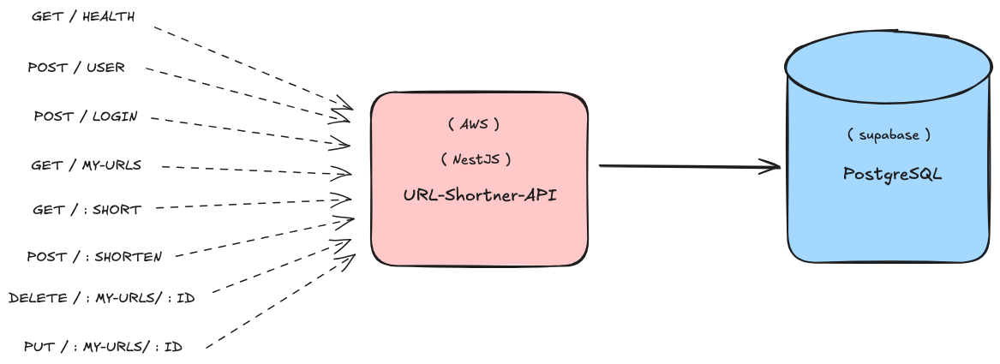

# Shorten URL API

Projeto encurtador de URL, utilizando __NestJS__ e possibilitando autenticação, registro de novos usuários, 
criação, deleção, atualização e busca de links acossiados a um usuário, além da funcionalidade de redirecionamento
para a URL original usando um código válido e previamente cadastrado. 

## Documentação detalhada e explicação do projeto. 

[1.AUTENTICAÇÃO](docs/AUTH.md) 
[2.DEPLOY](docs/DEPLOY.md) 
[3.LOCAL](docs/LOCAL.md) 
[4.LOGGER](docs/LOGGER.md) 
[5.SWAGGER](docs/OPEN_API.md) 
[6.ORM](docs/ORM.md) 
[7.REQUIREMENTS](docs/REQUIREMENTS.md) 
[8.TESTS](docs/TESTS.md) 
[9.OBSERVABILIDADE](docs/OBSERVABILITY.md) 
[10.ESCALABILIDADE](docs/SCALABILITY.md) 
[11.TREE](docs/TREE.md) 

## Tecnologias usadas

1. JWT
2. POSTGRESQL
3. DOCKER
4. NESTJS
5. TYPESCRIPT
6. AWS
7. TESTCONTAINERS
8. PRISMA ORM
9. SWAGGER
10. WINSTON LOGGER

## Extras que não entraram na versão

* KUBERNETES
* CI/CD
* OBSERVABILIDADE
* INFRAESTRUTURA COMO CÓDIGO
* HTTPS
