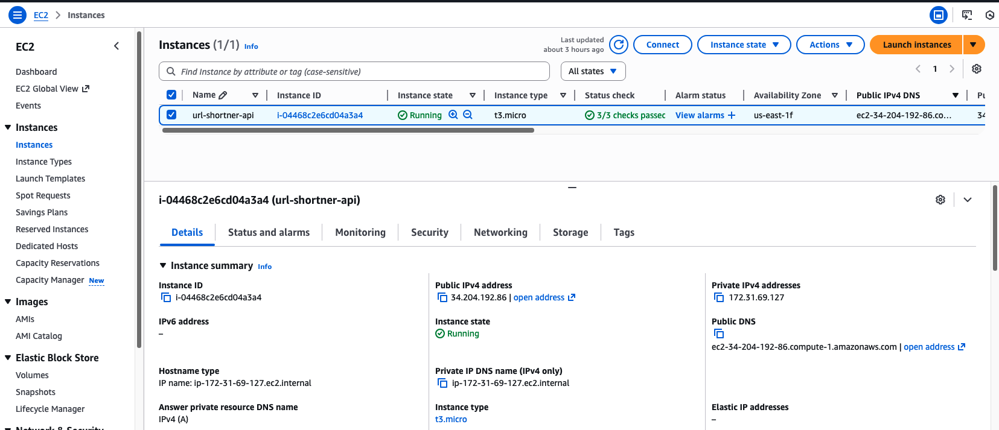
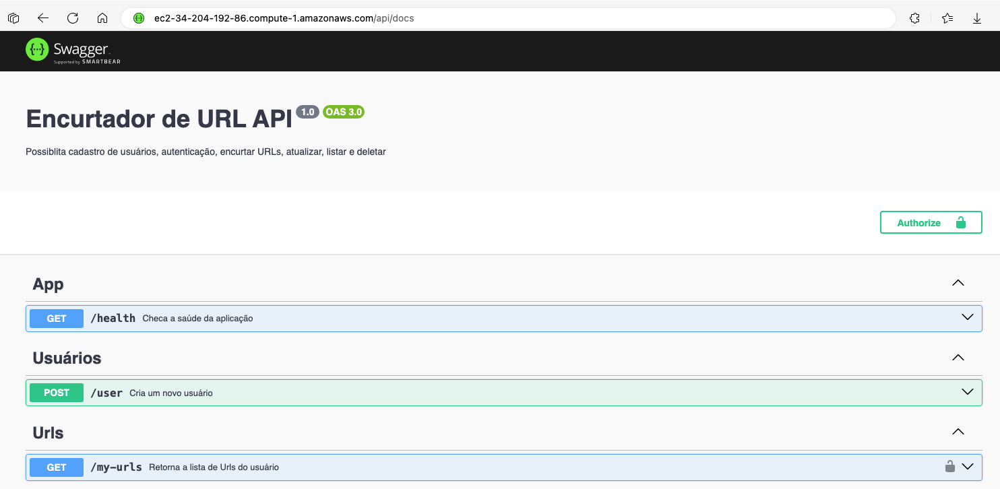

# Shorten URL API - LOCAL

## 1. Setup Inicial AWS

Para o deploy foi utilizado uma máquina __AWS EC2__, e a aplicação rodando no docker, o banco postgres foi usando o __supabase__ 
além de um proxy reverso usando a imagem do Nginx

*docker/url-shortner-prod/docker-compose.yml*
```yaml
services:
  reverse-proxy:
    container_name: nest_url_shortner-reverse-proxy-prod
    image: nginx:latest
    depends_on:
      - app
    volumes:
      - ./nginx/nginx.conf:/etc/nginx/nginx.conf
    ports:
      - 80:80
    networks:
      - dev

  app:
    container_name: nest-url-shortner-app-prod
    build:
      context: ../../
      dockerfile: docker/url-shortner-prod/Dockerfile
    restart: always
    env_file:
    - ../../.env 
    networks:
      - dev

networks:
  dev:
    driver: bridge
    name: 'nest-url-shortner'

```

*docker/url-shortner-prod/nginx/nginx.conf*
```
user www-data;
worker_processes auto;
pid /run/nginx.pid;
include /etc/nginx/modules-enabled/*.conf;

events {
    worker_connections 1024;
}

http {
    server {
        listen 80;
        server_name localhost 127.0.0.1;
        underscores_in_headers on;

        location / {
            proxy_pass http://nest-url-shortner-app-prod:3000;
            proxy_set_header X-Forwarded-For $remote_addr;
        }
    }
}

```


*EC2*<br />



## 2. HTTPS

Foi planejado habilitar o __HTTPS__ na aplicação mas envolvia a compra de um domínio e algumas horas para a validação, pagamento e 
habilitação do DNS, como o deploy foi feito no último dia do desafio, não foi possível aguardar essas horas e o tempo extra para 
configurar o certificado, possívelmente usando o __Let's Encrypt__, talvez maior tempo para a entrega fosse possível essa etapa.


*EC2*<br />
