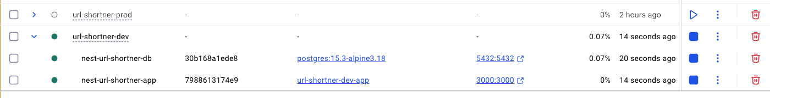

# Shorten URL API - LOCAL

[HOME - README](../README.md)

## 1. Setup Inicial (Apenas Docker)

Para que a aplicação rode localmente é necessário ter o **Docker** e o **Docker compose** disponíveis na máquina. Após fazer o dowload,
não é necessário .env uma vez que as variáveis de ambiente estão na definição do docker.

```yaml
app:
  container_name: nest-url-shortner-app
  build:
    context: ../../
    dockerfile: docker/url-shortner-dev/Dockerfile
  restart: always
  ports:
    - '3000:3000'
  environment:
    - NODE_ENV=production
    - DB_HOST=db
    - DB_PORT=5432
    - DB_NAME=nest_url_shortner
    - DB_USER=postgres
    - DB_PASSWORD=ps_secret
    - DATABASE_URL=postgresql://postgres:ps_secret@db:5432/nest_url_shortner?schema=public&connection_limit=5
    - JWT_SECRET=qKZcBLBzTS4c4dQ8SI9I2JaTV1MtUfhu
    - PORT=3000
  depends_on:
    db:
      condition: service_healthy
  networks:
    - dev
```

### 1.1 Usando Make

```sh
make up-dev
```

Se o Make estiver disponível na máquina, basta rodar o comando e será executado os comandos necessários para subir
o banco e a aplicação compilada usando nest build e nest start, é usando o script **wait-for.sh** para garantir
que a aplicação aguarde o banco estar ativo para iniciar conexção e realizar as migrações. Wait-for é disponibilizado
na própria documentação oficial do Postgres no docker hub.

http://localhost:3000/api/docs **(OBS: a porta 3000 é usada apenas no ambiente dev, em produção Ngix é usado como proxy reverso expondo apenas a porta 80)**



### 1.2 Usando apenas Docker compose

```sh
docker compose -f docker/url-shortner-prod/docker-compose.yml up -d --build
```

Usando apenas o docker compose, basta rodar na raiz do projeto esse comando.

## 2. Setup Inicial (Docker para o banco e npm localmente)

Para rodar localmente após baixar o código, criar um arquivo .env com o mesmo conteúdo de **env.example** disponível na raiz do
código

```bash
npm install
```

Antes de iniciar, basta criar o banco no postgres usando o próprio docker compose:

```bash
docker compose -f docker/url-shortner-dev/docker-compose.yml up db -d
```

```bash
npm run dev
```

1. Download do código
2. Instalar libs
3. Adicionar .env com mesmo conteúdo do .env.example
4. Start no banco via docker
5. npm run dev (esperar migração prisma finalizar, alguns segundos)

Navegar para:

http://localhost:3000/api/docs

## 3. Tests

Rodando localmente e apenas o banco no docker é possível rodar os testes, unitários e e2e

```sh
npm run test
npm run test:e2e
```
