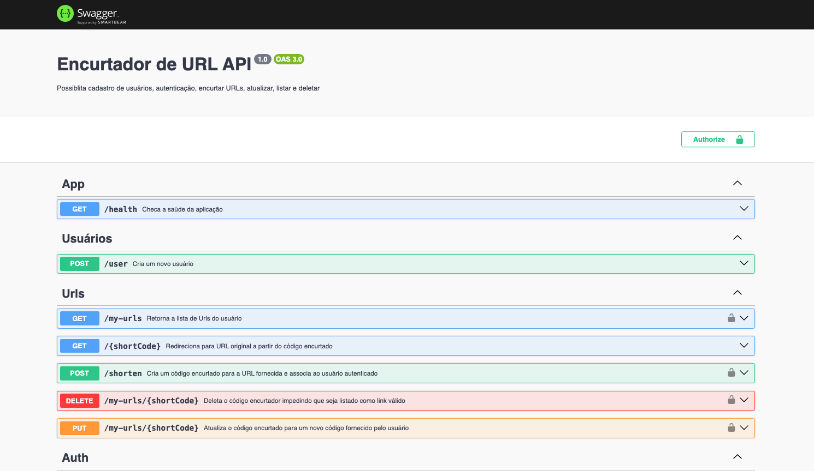

# Shorten URL API - OPEN API

## 1. Setup Inicial Swagger

Para a documentação da api, foi usado o swagger seguindo as boas práticas e os padrões
recomendados pelo NestJS.

source: [NestJS Swagger Tutorial](https://docs.nestjs.com/openapi/introduction)

```ts
//src/main.ts
async function bootstrap() {
  const app = await NestFactory.create(AppModule);
  app.useGlobalPipes(
    new ValidationPipe({
      transform: true,
      whitelist: true,
      forbidNonWhitelisted: true,
    }),
  );
  const config = new DocumentBuilder()
    .setTitle('Encurtador de URL API')
    .setDescription(
      'Possiblita cadastro de usuários, autenticação, encurtar URLs, atualizar, listar e deletar',
    )
    .setVersion('1.0')
    .addBearerAuth(
      {
        type: 'http',
        scheme: 'bearer',
        bearerFormat: 'JWT',
        name: 'JWT',
        description: 'Enter JWT token',
        in: 'header',
      },
      'JWT-auth',
    )
    .build();

  const document = SwaggerModule.createDocument(app, config);
  SwaggerModule.setup('api/docs', app, document);

  await app.listen(process.env.PORT ?? 3000);
}
bootstrap();
```


## 2. Utilização

```ts
  //src/url/url.controller
  @ApiBearerAuth('JWT-auth')
  @ApiOperation({
    summary:
      'Atualiza o código encurtado para um novo código fornecido pelo usuário',
  })
  @ApiResponse({
    status: 200,
    description: 'URL atualizada com sucesso',
  })
  @ApiResponse({ status: 404, description: 'URL não encontrada' })
  @ApiResponse({ status: 401, description: 'Acesso negado' })
  @Put('my-urls/:shortCode')
  async update(
    @AuthUser() user: UserJWTPayload,
    @Param('shortCode') shortCode: string,
    @Body() body: UpdateShortenDTO,
  ) {
    await this.urlService.updateUrl(shortCode, body.url, user.userId);
  }
```

## 3. Resultado


<!--  -->